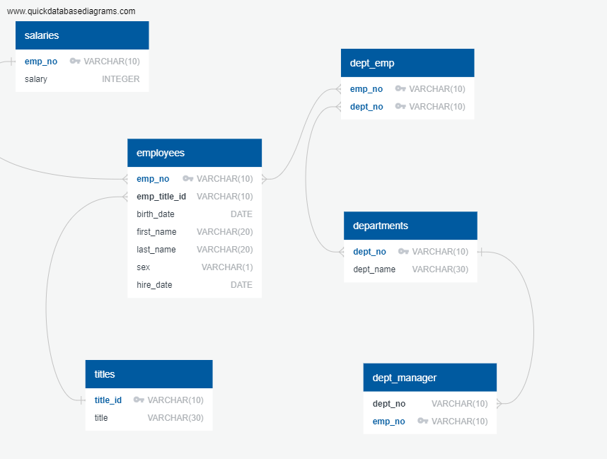
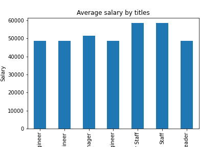
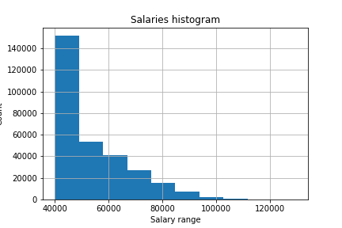

In this activity, I created a few databases of a company, including data of employees information, salaries, departments, managers... I created an ERD to show the connection between the databases.

ERD:

I did somes SQL queries to get some of the essential data. Finally, I used Python with SQLAlchemy library to connect the databases and create some charts using Python.

